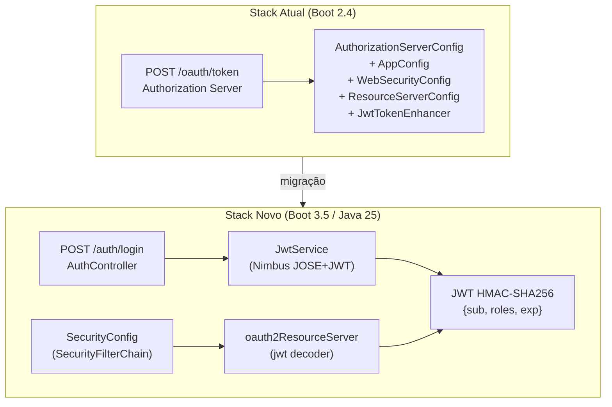
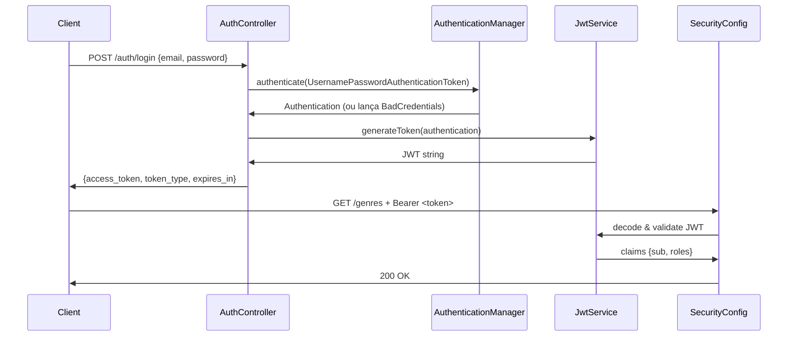

# Java 25 Migration — Design

**Spec:** `.specs/features/java25-migration/spec.md`
**Status:** Draft

---

## Architecture Overview

A migração tem **duas categorias de mudança**:

1. **Mecânica pura** — find-and-replace (javax→jakarta, remoção de dependências, properties)
2. **Arquitetural** — substituição do stack OAuth2 legado por Spring Security 6 stateless JWT



### Fluxo de Autenticação Novo



---

## Code Reuse Analysis

### Componentes Mantidos (sem alteração)

| Componente | Localização | Observação |
|---|---|---|
| `UserService` | `services/UserService.java` | `UserDetailsService.loadUserByUsername` — reutilizado por `AuthenticationManager` |
| `AuthService` | `services/AuthService.java` | `SecurityContextHolder.getContext()` — funciona igual em Spring Security 6 |
| `User` (entity) | `entities/User.java` | `UserDetails` — interface não mudou; apenas `javax.persistence` → `jakarta.persistence` |
| `Role`, `Genre`, `Movie`, `Review` | `entities/*.java` | Só namespace javax→jakarta |
| `LogFields` | `common/LogFields.java` | Só namespace javax→jakarta |
| Todos os DTOs | `dtos/*.java` | Só namespace javax.validation → jakarta.validation |
| Todos os Repositories | `repositories/*.java` | Sem alteração |
| `GenreService`, `MovieService`, `ReviewsService` | `services/` | Sem alteração |
| Todos os Resources (controllers) | `resources/` | Sem alteração de lógica; apenas namespace se houver |
| `data.sql` | `resources/data.sql` | Sem alteração |
| `application*.properties` | `resources/` | Remove `security.oauth2.*`; adiciona `jwt.secret` já existe |

### Componentes Deletados

| Componente | Motivo |
|---|---|
| `AuthorizationServerConfig.java` | Depende de `spring-security-oauth2-autoconfigure` (removido do Boot 3) |
| `WebSecurityConfig.java` | `WebSecurityConfigurerAdapter` foi removido no Spring Security 6 |
| `ResourceServerConfig.java` | `ResourceServerConfigurerAdapter` foi removido; lógica migra para `SecurityConfig` |
| `AppConfig.java` (parcial) | Remove `JwtAccessTokenConverter` e `JwtTokenStore` (classes oauth2); mantém `BCryptPasswordEncoder` bean |
| `JwtTokenEnhancer.java` | `TokenEnhancer` é classe oauth2 removida; lógica de claims migra para `JwtService` |
| `SwaggerConfig.java` | Springfox — SpringDoc não precisa de config manual para auto-discovery |

### Componentes Novos

| Componente | Localização | Propósito |
|---|---|---|
| `SecurityConfig.java` | `config/SecurityConfig.java` | Substitui WebSecurityConfig + ResourceServerConfig com Spring Security 6 DSL |
| `JwtService.java` | `services/JwtService.java` | Emite e valida JWT via Nimbus JOSE+JWT (HMAC-SHA256) |
| `AuthController.java` | `resources/AuthController.java` | `POST /auth/login` → {access_token, token_type, expires_in} |
| `LoginRequestDTO.java` | `dtos/LoginRequestDTO.java` | `{email, password}` para o endpoint de login |
| `TokenResponseDTO.java` | `dtos/TokenResponseDTO.java` | `{access_token, token_type, expires_in}` |

---

## Components

### `SecurityConfig.java` (novo)

- **Purpose:** Único ponto de configuração de segurança. Expõe `SecurityFilterChain`, `AuthenticationManager`, e `BCryptPasswordEncoder` bean.
- **Location:** `config/SecurityConfig.java`
- **Interfaces:**
  - `securityFilterChain(HttpSecurity http): SecurityFilterChain` — configura rotas públicas/protegidas, stateless session, oauth2ResourceServer JWT decoder
  - `authenticationManager(AuthenticationConfiguration config): AuthenticationManager` — bean exposto para `AuthController`
- **Dependencies:** `UserService` (via `UserDetailsService`), `JwtService` (para o decoder)
- **Reuses:** Lógica de autorização de rotas de `ResourceServerConfig` (mesmos paths e roles)

```java
// Esboço das regras de acesso (mesmo contrato que ResourceServerConfig)
.requestMatchers("/auth/login").permitAll()
.requestMatchers("/h2-console/**").permitAll()   // apenas profile test
.requestMatchers(GET, "/genres/**", "/movies/**").hasAnyRole("VISITOR","MEMBER")
.requestMatchers(POST, "/reviews/**").hasAnyRole("MEMBER","ADMIN")
.anyRequest().authenticated()
// + oauth2ResourceServer(jwt → NimbusJwtDecoder com chave simétrica)
```

### `JwtService.java` (novo)

- **Purpose:** Centraliza emissão e validação de JWT com HMAC-SHA256 (Nimbus JOSE+JWT incluído transitivamente por `spring-boot-starter-oauth2-resource-server`).
- **Location:** `services/JwtService.java`
- **Interfaces:**
  - `generateToken(Authentication auth): String` — emite JWT com `sub=email`, `roles=[...]`, `exp=now+jwtDuration`
  - `jwtDecoder(): JwtDecoder` — bean usado pelo `oauth2ResourceServer` para validar tokens
- **Dependencies:** `@Value("${jwt.secret}")`, `@Value("${jwt.duration}")`
- **Reuses:** `jwt.secret` e `jwt.duration` já presentes em todas as properties

### `AuthController.java` (novo)

- **Purpose:** Endpoint público `POST /auth/login` que autentica e retorna JWT.
- **Location:** `resources/AuthController.java`
- **Interfaces:**
  - `login(@RequestBody LoginRequestDTO req): ResponseEntity<TokenResponseDTO>`
- **Dependencies:** `AuthenticationManager`, `JwtService`
- **Reuses:** Padrão de controller REST já em uso nos demais resources

### `LoginRequestDTO.java` / `TokenResponseDTO.java` (novos)

- **Purpose:** Payload de request e response para o endpoint de login.
- **Location:** `dtos/`
- **Reuses:** Padrão de DTOs existente no projeto

### `AppConfig.java` (modificado)

- **Purpose:** Mantém apenas `BCryptPasswordEncoder` bean (os beans `JwtAccessTokenConverter` e `JwtTokenStore` são removidos).
- **Location:** `config/AppConfig.java`
- **Reuses:** Bean existente; apenas remove os beans oauth2

---

## Data Models

### `LoginRequestDTO`

```java
public class LoginRequestDTO {
    @NotBlank private String email;
    @NotBlank private String password;
}
```

### `TokenResponseDTO`

```java
public class TokenResponseDTO {
    private String accessToken;   // "access_token" no JSON
    private String tokenType;     // "Bearer"
    private long expiresIn;       // segundos
}
```

### JWT Claims

```json
{
  "sub": "ana@gmail.com",
  "roles": ["ROLE_VISITOR", "ROLE_MEMBER"],
  "iat": 1753380000,
  "exp": 1753466400
}
```

---

## Properties Changes

### `application-test.properties`

```diff
- security.oauth2.client.client-id=movieflix
- security.oauth2.client.client-secret=movieflix123
  jwt.secret=MY-JWT-SECRET
  jwt.duration=86400
```

### `application-dev.properties`

```diff
- security.oauth2.client.client-id=movieflix
- security.oauth2.client.client-secret=movieflix123
  jwt.secret=MY-JWT-SECRET
  jwt.duration=86400
```

---

## Tests Migration Strategy

Os 3 ITs (`GenreResourceIT`, `MovieResourceIT`, `ReviewResourceIT`) usam `obtainAccessToken()` que chama `POST /oauth/token` com `httpBasic`. Após a migração, essa função deve chamar `POST /auth/login` com JSON body.

**Helper a criar:** `TokenHelper` (ou método utilitário nos próprios ITs) que faz `POST /auth/login` com `{email, password}` e devolve `access_token`.

```java
// Antes (OAuth2)
mockMvc.perform(post("/oauth/token").params(params).with(httpBasic(clientId, clientSecret)))

// Depois (novo endpoint)
mockMvc.perform(post("/auth/login")
        .contentType(MediaType.APPLICATION_JSON)
        .content("{\"email\":\"" + username + "\",\"password\":\"" + password + "\"}"))
```

As anotações `@Value("${security.oauth2.client.client-id}")` nos ITs são removidas (properties não existem mais).

---

## Error Handling Strategy

| Cenário | Tratamento | Resposta |
|---|---|---|
| Credenciais inválidas | `BadCredentialsException` capturada no `AuthController` | HTTP 401 |
| Token ausente | Spring Security intercepta antes do controller | HTTP 401 |
| Token com assinatura inválida | `JwtDecoder` rejeita → Spring Security | HTTP 401 |
| Token expirado | `JwtDecoder` rejeita → Spring Security | HTTP 401 |
| Role insuficiente | Spring Security `AccessDeniedException` | HTTP 403 |
| Body malformado em `/auth/login` | Spring `HttpMessageNotReadableException` | HTTP 400 |

---

## Risks & Concerns

| Concern | Localização | Impacto | Mitigação |
|---|---|---|---|
| Tests usam `POST /oauth/token` com form params | `GenreResourceIT`, `MovieResourceIT`, `ReviewResourceIT` — `obtainAccessToken()` | Todos os ITs falham sem atualização | Task dedicada: migrar `obtainAccessToken()` para JSON POST em `/auth/login` |
| `@Value("${security.oauth2.client.*}")` nos ITs | `GenreResourceIT:42-46`, `ReviewResourceIT:41-45`, `MovieResourceIT` | `IllegalArgumentException` ao carregar contexto de teste | Remover as anotações e os `@Value` fields junto com a task de ITs |
| `application-dev.properties` tem `javax.persistence.*` em comentário | `application-dev.properties:2` | Não impacta compilação (é comentário) mas é confuso | Atualizar para `jakarta.persistence.*` no mesmo passo |
| `AuthService.authenticated()` usa `SecurityContextHolder` | `services/AuthService.java:23` | Spring Security 6 com JWT popula o contexto de forma diferente — `getName()` retorna o `sub` do JWT (email) | OK: o `sub` é o email, `findByEmail(username)` continua funcionando |
| `User.hasHole()` — typo de `hasRole` | `entities/User.java:120` | Nome confuso mas funcional | Fora do escopo desta migração (conservadora); anotado em STATE.md |
| H2 console em `test` profile | `ResourceServerConfig:45-46` `http.headers().frameOptions().disable()` | Precisa ser replicado no novo `SecurityConfig` | Task MIG-07 inclui frame options disable explícito para profile test |
| `spring.jpa.properties.javax.persistence.*` em dev.properties | `application-dev.properties:2-5` | Hibernately ignora chaves javax.* no Boot 3 | Atualizar keys para `jakarta.persistence.*` |

---

## Tech Decisions

| Decisão | Escolha | Rationale |
|---|---|---|
| Algoritmo JWT | HMAC-SHA256 (HS256) | Simétrico: mesma chave para sign e verify; sem JWKS endpoint; adequado para serviço único |
| Nimbus JOSE+JWT | Transitivo via `spring-boot-starter-oauth2-resource-server` | Não adicionar dependência explícita; versão gerenciada pelo Boot BOM |
| `@Bean JwtDecoder` | `NimbusJwtDecoder.withSecretKey(secretKey)` em `JwtService` | Spring Security 6 auto-detecta o bean e o usa no `oauth2ResourceServer` |
| Claims de roles | Lista `roles` no JWT; `JwtAuthenticationConverter` extrai via `roles` claim | Evita depender do claim `scope` (padrão OAuth2); compatível com a estrutura de roles existente |
| `BCryptPasswordEncoder` | Mantido em `AppConfig` (bean existente) | Conservador: não mover sem necessidade |

> **Decisão de projeto (AD-001):** JWT stateless com HMAC-SHA256 via `spring-boot-starter-oauth2-resource-server`. Endpoint de login: `POST /auth/login`. Claims: `sub=email`, `roles=[...]`. Esta é a convenção de autenticação deste projeto.
