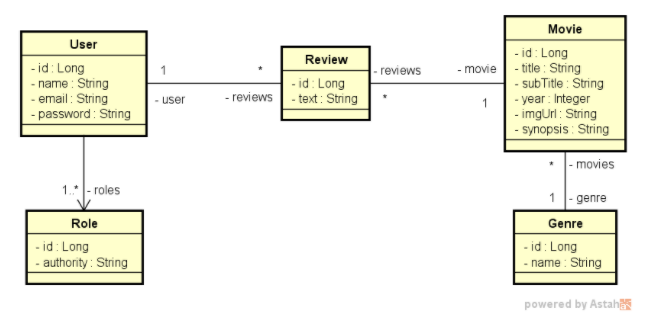

# 💻 Back end Movieflix

A api foi desenvolvida como projeto final para o Bootcamp da DevSuperior. Com ela é possível ver todos os filmes, ver
filmes por categoria e realizar comentários nos filmes.

A implantação da api foi feita utilizando o heroku.

**Atenção**: Você precisa ter o java jdk 11 instalado na sua máquina bem como o `PATH_VARIABLE` do java configurado e
uma IDE de sua preferência.

## 🔌 Configurações para inicialização

- **O back end está setado em modo de TESTE, sua aplicação funcionará localmente, e será utilizado o banco de dados em
  memória (H2).**

Execute o comando: `mvn install` para instalar as dependências do maven.

Após baixar as dependências, execute a aplicação e a api estará rodando em http://localhost:8080.

Acesso ao banco de dados: `http://localhost:8080/h2-console`.

## 🗺️ Diagrama de Classes - Modelo de Domínio



## 🧾 Documentação

A documentação da api foi gerada através do Swagger e pode ser acessada em `http://localhost:8080/swagger-ui.html#`

## 📌 Endpoints

Os seguintes endpoints estão configurados:

**ATENÇÃO:**

- `/h2-console`
- `/swagger-ui.html#`
- [POST] `/oauth/token`

Estão **liberadas** para acesso **sem autenticação**. Caso queira acessar as **demais** rotas é necessário **realizar
autenticação** no sistema.

### Auth

- `/oauth/token` - POST - Realiza o login do usuário na aplicação.

**OBS¹:** No momento de fazer a requisição, configure a "Authorization" como `Basic Auth` e repasse
o `client-id=movieflix` e o `client-secret=movieflix123`.

**OBS²:** O corpo da requisição deve ser do tipo `x-www-form-urlencoded`, crie os campos "username",
"password" e "grant_type".

- Em "username", coloque seu valor como `admin@gmail.com`.
- Em "password", coloque seu valor como `123456`.
- Em "grant_type", coloque seu valor como `password`. (Isso indica o método de autenticação do sistema).

**OBS³:** O usuário "admin" é super-usuário da aplicação, dessa forma tem acesso a todas as rotas. Caso queira ver
outros usuários veja o arquivo em `src/main/resources/data.sql`.

### Genres

**APENAS USUÁRIOS AUTENTICADOS PODEM ACESSAR AS ROTAS**

- `/genres` - GET - Exibe todos os gêneros cadastrados na api.

### Movies

**APENAS USUÁRIOS AUTENTICADOS PODEM ACESSAR AS ROTAS**

- `/movies/api/test` - GET - Exibe todos os filmes cadastrados na api.
- `/movies` - GET - Exibe todos os filmes cadastrados paginados e ordenados por título.
- `/movies/{id}` - GET - Exibe as informações específicas de um filme bem como seus comentários (reviews).

### Reviews

**APENAS USUÁRIOS AUTENTICADOS PODEM ACESSAR AS ROTAS**

- `/reviews` - POST - Cria uma review para um determinado filme existente. **AUTENTICAÇÃO COMO MEMBER OU ADMIN
  NECESSÁRIA**

**Exemplo de dados para criar uma Review (JSON)**

```json
{
  "movieId": "1",
  "text": "Nice movie, adorable!"
}
```

## 🛠️ Ferramentas

1. Java
2. Springboot
3. Spring Data JPA
4. Spring Validation
5. Spring Cloud
6. Spring Security
7. Spring Security Oauth2
8. Swagger (Documentação)
9. H2 database
10. postgresql

## 💾 Dados para povoar a api

Na pasta `src/main/resources` existe um arquivo **data.sql** com alguns dados já adicionados, para inserir novos dados
manualmente, basta incluí-los no arquivo. 