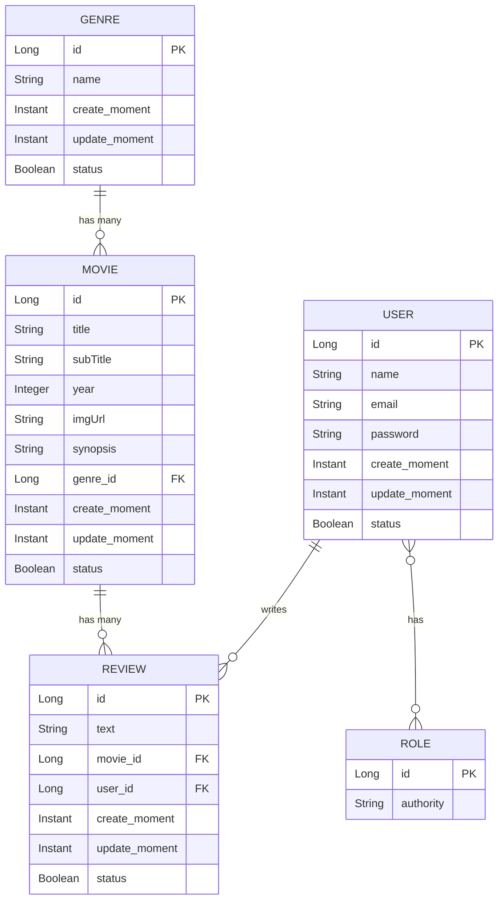
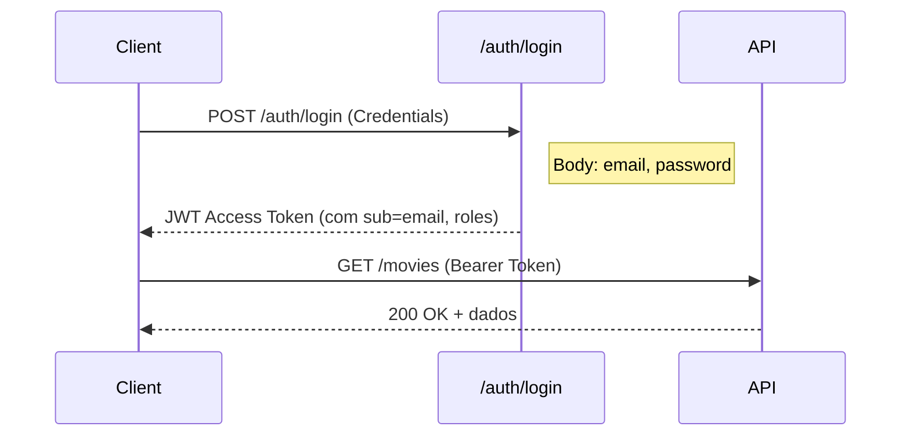

# 🎬 Movieflix Backend — Architecture & Guidelines

> **Propósito deste documento:** Fornecer uma visão completa e detalhada da arquitetura, convenções e regras de negócio do backend Movieflix para que qualquer agente LLM possa compreender, navegar e modificar o código com segurança.

---

## 1. Visão Geral do Projeto

**Movieflix** é uma API REST desenvolvida em **Java 25** com **Spring Boot 3.5.3** como projeto final do Bootcamp da DevSuperior. Permite listar filmes por categoria, visualizar detalhes e realizar comentários (reviews).

| Item | Valor |
|------|-------|
| **Group ID** | `com.devgabriel` |
| **Artifact ID** | `movieflix` |
| **Java Version** | 25 |
| **Spring Boot** | 3.5.3 |
| **Spring Cloud** | (removido na migração) |
| **Base Package** | `com.devgabriel.movieflix` |
| **Porta padrão** | 8080 |

---

## 2. Stack Tecnológica

| Tecnologia | Uso |
|------------|-----|
| Spring Boot Starter Web | API REST |
| Spring Data JPA | Persistência e repositórios |
| Spring Security 6 | Autenticação e autorização (JWT Stateless) |
| Spring Validation | Validação de DTOs |
| H2 Database | Banco em memória (perfil `test`) |
| PostgreSQL | Banco de produção (perfis `dev` e `prod`) |
| SpringDoc OpenAPI 3 | Documentação da API (v2.8.18) |
| BCrypt | Encoding de senhas |
| BCrypt | Encoding de senhas |

---

## 3. Estrutura de Pacotes

```
com.devgabriel.movieflix/
├── MovieflixApplication.java          # Classe principal @SpringBootApplication
├── common/
│   └── LogFields.java                 # @MappedSuperclass com campos de auditoria
├── components/
│   └── JwtTokenEnhancer.java          # Enriquece JWT com userId e userName
├── config/
│   ├── AppConfig.java                 # Bean do BCryptPasswordEncoder
│   ├── SecurityConfig.java            # Configuração do Spring Security 6 e Roles
│   ├── JwtService.java                # Assina e valida JWT com HMAC-SHA256
│   └── SwaggerConfig.java             # Docket do SpringDoc OpenAPI
├── dtos/
│   ├── GenreDTO.java
│   ├── MovieDTO.java
│   ├── ReviewDTO.java                 # Contém validações (@NotBlank, @Size)
│   ├── RoleDTO.java
│   └── UserDTO.java
├── entities/
│   ├── Genre.java                     # extends LogFields
│   ├── Movie.java                     # extends LogFields
│   ├── Review.java                    # extends LogFields
│   ├── Role.java                      # implements Serializable (NÃO extends LogFields)
│   └── User.java                      # extends LogFields, implements UserDetails
├── repositories/
│   ├── GenreRepository.java
│   ├── MovieRepository.java          # Query customizada para filtro por gênero
│   ├── ReviewRepository.java
│   ├── RoleRepository.java
│   └── UserRepository.java           # findByEmail(String email)
├── resources/
│   ├── GenreResource.java             # Controller: GET /genres
│   ├── MovieResource.java             # Controller: GET /movies, GET /movies/{id}
│   ├── ReviewResource.java            # Controller: POST /reviews
│   └── exceptions/
│       ├── FieldMessage.java
│       ├── OAuthCustomError.java
│       ├── ResourceExceptionHandler.java  # @ControllerAdvice
│       ├── StandardError.java
│       └── ValidationError.java
└── services/
    ├── AuthService.java               # Obtém usuário autenticado do SecurityContext
    ├── GenreService.java
    ├── MovieService.java
    ├── ReviewsService.java            # Cria reviews vinculadas ao usuário autenticado
    ├── UserService.java               # Implementa UserDetailsService
    └── exceptions/
        ├── ForbiddenException.java
        ├── ResourceNotFoundException.java
        └── UnauthorizedException.java
```

---

## 4. Modelo de Domínio

### 4.1 Diagrama de Entidades



### 4.2 Tabelas do Banco de Dados

| Entidade | Tabela | Herda LogFields? |
|----------|--------|-------------------|
| Genre | `tb_genre` | ✅ Sim |
| Movie | `tb_movie` | ✅ Sim |
| Review | `tb_review` | ✅ Sim |
| User | `tb_user` | ✅ Sim |
| Role | `tb_role` | ❌ Não |
| User ↔ Role (join) | `tb_user_role` | — |

### 4.3 Classe Base: LogFields

Todas as entidades (exceto `Role`) estendem `LogFields` (`@MappedSuperclass`), que fornece:

| Campo | Tipo | Anotações | Default |
|-------|------|-----------|---------|
| `createMoment` | `Instant` | `@CreatedDate`, `@Column(updatable=false)` | `Instant.now()` |
| `updateDate` | `Instant` | `@LastModifiedDate`, `@Column(insertable=false)` | `Instant.now()` |
| `status` | `Boolean` | `@JsonFormat(shape=NUMBER)` | `true` |

### 4.4 Relacionamentos

| Relação | Tipo | Fetch | Mapeamento |
|---------|------|-------|------------|
| Genre → Movie | `@OneToMany` | LAZY (padrão) | `mappedBy = "genre"` |
| Movie → Genre | `@ManyToOne` | EAGER (padrão) | `@JoinColumn(name = "genre_id")` |
| Movie → Review | `@OneToMany` | LAZY (padrão) | `mappedBy = "movie"` |
| Review → Movie | `@ManyToOne` | EAGER (padrão) | `@JoinColumn(name = "movie_id")` |
| Review → User | `@ManyToOne` | EAGER (padrão) | `@JoinColumn(name = "user_id")` |
| User → Review | `@OneToMany` | LAZY (padrão) | `mappedBy = "user"` |
| User ↔ Role | `@ManyToMany` | **EAGER** | `@JoinTable(name = "tb_user_role")` |

---

## 5. Camada de DTOs

### 5.1 Padrão de Conversão

Todos os DTOs implementam `Serializable` e possuem:
- Construtor sem argumentos
- Construtor que recebe a entidade correspondente
- Anotações `@ApiModelProperty` para o Swagger

### 5.2 Mapeamento Entity → DTO

| DTO | Campos | Validações | Notas |
|-----|--------|------------|-------|
| `GenreDTO` | id, name | — | Cópia direta da entidade |
| `MovieDTO` | id, title, subTitle, year, imgUrl, synopsis, genreId, reviews | — | Achata Genre para `genreId`; embarca `List<ReviewDTO>` |
| `ReviewDTO` | id, text, user, movieId | `@NotBlank`, `@Size(min=4)` | Achata Movie para `movieId`; embarca `UserDTO` |
| `RoleDTO` | id, authority | — | Cópia direta |
| `UserDTO` | id, name, email, roles | — | **Exclui password** (segurança); embarca `List<RoleDTO>` |

> [!IMPORTANT]
> `ReviewDTO` é o **único DTO com validação**. O campo `text` exige `@NotBlank` e `@Size(min=4)`.

### 5.3 Serialização JSON

`MovieDTO` usa `@JsonPropertyOrder` para controlar a ordem dos campos:
```
id → title → subTitle → year → imgUrl → synopsis → genreId → reviews
```

---

## 6. Camada de Repositórios

| Repositório | Entidade | Queries Customizadas |
|-------------|----------|----------------------|
| `GenreRepository` | Genre | Nenhuma |
| `MovieRepository` | Movie | `findMoviesAndGenreOrderByTitle(Genre, Pageable)` — JPQL com filtro opcional por gênero |
| `ReviewRepository` | Review | Nenhuma |
| `RoleRepository` | Role | Nenhuma |
| `UserRepository` | User | `findByEmail(String email)` — derived query |

### Query Customizada — MovieRepository

```java
@Query("SELECT obj FROM Movie obj INNER JOIN obj.genre "
     + "WHERE (:genre IS NULL OR obj.genre = :genre) "
     + "ORDER BY obj.title")
Page<Movie> findMoviesAndGenreOrderByTitle(Genre genre, Pageable pageable);
```

- Quando `genre` é `null`, retorna todos os filmes
- Resultado paginado e ordenado por título

---

## 7. Camada de Serviços

### 7.1 AuthService

| Método | Retorno | Comportamento |
|--------|---------|---------------|
| `authenticated()` | `User` | Obtém o usuário do `SecurityContextHolder`, busca por email no banco. Lança `UnauthorizedException` se falhar. |

### 7.2 UserService (implements `UserDetailsService`)

| Método | Retorno | Comportamento |
|--------|---------|---------------|
| `loadUserByUsername(email)` | `UserDetails` | Busca usuário por email. Lança `UsernameNotFoundException` se não encontrar. Usado pelo Spring Security. |

### 7.3 GenreService

| Método | Retorno | Comportamento |
|--------|---------|---------------|
| `findAll()` | `List<GenreDTO>` | Retorna todos os gêneros ordenados por nome. `@Transactional(readOnly=true)` |

### 7.4 MovieService

| Método | Parâmetros | Retorno | Comportamento |
|--------|------------|---------|---------------|
| `findMovies(genreId, pageable)` | Long, Pageable | `Page<MovieDTO>` | Se `genreId == 0`, busca todos; senão filtra por gênero. `@Transactional(readOnly=true)` |
| `findById(id)` | Long | `MovieDTO` | Busca filme por ID com reviews. Lança `ResourceNotFoundException` se não encontrar. `@Transactional(readOnly=true)` |

### 7.5 ReviewsService

| Método | Parâmetros | Retorno | Comportamento |
|--------|------------|---------|---------------|
| `insert(dto)` | ReviewDTO | `ReviewDTO` | Obtém usuário autenticado via `AuthService`, cria Review vinculada ao filme e ao usuário, persiste e retorna DTO. `@Transactional` |

> [!NOTE]
> O `ReviewsService` é o único service com operação de escrita. Ele depende do `AuthService` para vincular a review ao usuário logado.

---

## 8. Camada de Controllers (Resources)

### 8.1 Endpoints

| Controller | Método HTTP | Endpoint | Parâmetros | Retorno | Status |
|------------|-------------|----------|------------|---------|--------|
| `GenreResource` | GET | `/genres` | — | `List<GenreDTO>` | 200 |
| `MovieResource` | GET | `/movies` | `genreId` (default=0), `Pageable` | `Page<MovieDTO>` | 200 |
| `MovieResource` | GET | `/movies/{id}` | `id` (path) | `MovieDTO` | 200 |
| `ReviewResource` | POST | `/reviews` | `@Valid @RequestBody ReviewDTO` | `ReviewDTO` | 201 |

### 8.2 Convenções dos Controllers

- Base path definido via `@RequestMapping` na classe
- Retorno via `ResponseEntity<T>`
- URI de criação montada com `ServletUriComponentsBuilder` (POST /reviews)
- Validação com `@Valid` no body do POST

---

## 9. Tratamento de Exceções

### 9.1 Exceções Customizadas

| Exceção | Pacote | HTTP Status |
|---------|--------|-------------|
| `ResourceNotFoundException` | `services.exceptions` | 404 NOT_FOUND |
| `ForbiddenException` | `services.exceptions` | 403 FORBIDDEN |
| `UnauthorizedException` | `services.exceptions` | 401 UNAUTHORIZED |

Todas estendem `RuntimeException`.

### 9.2 ResourceExceptionHandler (`@ControllerAdvice`)

| Handler Method | Exceção Capturada | Status HTTP | Corpo da Resposta |
|----------------|-------------------|-------------|-------------------|
| `handleEntityNotFound` | `ResourceNotFoundException` | 404 | `StandardError` |
| `handleMethodArgumentNotValid` | `MethodArgumentNotValidException` | 422 | `ValidationError` (com lista de `FieldMessage`) |
| `handleForbiddenException` | `ForbiddenException` | 403 | `StandardError` |
| `handleUnauthorizedException` | `UnauthorizedException` | 401 | `StandardError` |

### 9.3 Estrutura dos Erros

```json
// StandardError
{
  "timestamp": "2024-01-01T00:00:00Z",
  "status": 404,
  "error": "Resource not found",
  "message": "Recurso não encontrado",
  "path": "/movies/999"
}

// ValidationError (extends StandardError)
{
  "timestamp": "2024-01-01T00:00:00Z",
  "status": 422,
  "error": "Validation exception",
  "message": "Validation error",
  "path": "/reviews",
  "errors": [
    { "fieldName": "text", "message": "Você deve informar um texto" }
  ]
}
```

---

## 10. Segurança e Autenticação

### 10.1 Fluxo JWT Stateless



### 10.2 Configuração da Segurança

| Parâmetro | Valor Default | Variável de Ambiente |
|-----------|---------------|----------------------|
| JWT Secret | `MY-JWT-SECRET` | `JWT_SECRET` |
| JWT Duration | `86400` (24h) | `JWT_DURATION` |

### 10.3 JWT Service

O `JwtService` cria tokens com os seguintes claims:
- `sub` — email do usuário
- `roles` — lista de roles (VISITOR, MEMBER)

### 10.4 Controle de Acesso por Rota

| Rota | Método | Acesso |
|------|--------|--------|
| `/auth/login` | POST | **Público** (sem autenticação) |
| `/h2-console/**` | ANY | **Público** |
| `/genres/**` | GET | Qualquer usuário autenticado |
| `/movies/**` | GET | Qualquer usuário autenticado |
| `/reviews` | POST | `VISITOR` ou `MEMBER` |
| Demais rotas | ANY | Qualquer usuário autenticado |

### 10.5 Roles do Sistema

| Role | Permissões |
|------|-----------|
| `VISITOR` | Leitura (gêneros, filmes). **NÃO pode** criar reviews |
| `MEMBER` | Leitura + Criação de reviews |

> [!WARNING]
> Apesar da configuração em `ResourceServerConfig` listar `VISITOR` e `MEMBER` para POST `/reviews`, os testes de integração mostram que `VISITOR` recebe **403 Forbidden** ao tentar criar review. Isso indica que há uma validação adicional de role a nível de aplicação ou que a configuração de segurança trata VISITOR diferentemente na prática.

### 10.6 CORS

| Parâmetro | Valor Default | Variável de Ambiente |
|-----------|---------------|----------------------|
| Allowed Origins | `http://localhost:3000, http://localhost:5173` | `CORS_ORIGINS` |
| Allowed Methods | POST, GET, PUT, DELETE, PATCH | — |
| Allow Credentials | true | — |
| Allowed Headers | * (todos) | — |

---

## 11. Perfis de Execução

### 11.1 Configuração por Perfil

| Perfil | Banco de Dados | Ativação | Notas |
|--------|---------------|----------|-------|
| `test` (padrão) | H2 em memória (`jdbc:h2:mem:testdb`) | Default | Console H2 habilitado em `/h2-console` |
| `dev` | PostgreSQL local (`localhost:5432/movieflix`) | `APP_PROFILE=dev` | DDL auto = none |
| `prod` | PostgreSQL (env var) | `APP_PROFILE=prod` | `DATABASE_URL` via variável de ambiente |

### 11.2 Propriedades Comuns (`application.properties`)

```properties
spring.profiles.active=${APP_PROFILE:test}
spring.jpa.open-in-view=false
jwt.secret=${JWT_SECRET:MY-JWT-SECRET}
jwt.duration=${JWT_DURATION:86400}
client.id=${CLIENT_ID:movieflix}
client.secret=${CLIENT_SECRET:movieflix123}
cors.origins=${CORS_ORIGINS:http://localhost:3000,http://localhost:5173}
```

> [!TIP]
> `spring.jpa.open-in-view=false` está desabilitado, evitando o anti-pattern de lazy loading em controllers. Todas as consultas são resolvidas na camada de serviço.

---

## 12. Dados de Seed (`data.sql`)

O arquivo `src/main/resources/data.sql` popula o banco no perfil `test` com:

### Roles
| ID | Authority |
|----|-----------|
| 1 | VISITOR |
| 2 | MEMBER |

### Usuários (senha: `123456` — BCrypt encoded)
| ID | Nome | Email | Roles |
|----|------|-------|-------|
| 1 | Ana | ana@gmail.com | VISITOR |
| 2 | Bob | bob@gmail.com | VISITOR, MEMBER |
| 3 | Admin | admin@gmail.com | VISITOR, MEMBER |

### Gêneros
| ID | Nome |
|----|------|
| 1 | Ação |
| 2 | Comédia |
| 3 | Drama |
| 4 | Ficção Científica |
| 5 | Romance |

### Filmes (10 registros)
| ID | Título | Gênero |
|----|--------|--------|
| 1 | Missão impossível | Ação |
| 2 | John Wick | Ação |
| 3 | O auto da compadecida | Comédia |
| 4 | As branquelas | Comédia |
| 5 | Matrix | Ficção Científica |
| 6 | A culpa é das estrelas | Romance |
| 7 | Como eu era antes de você | Romance |
| 8 | Até o último homem | Ação |
| 9 | Coringa | Drama |
| 10 | De volta para o futuro | Ficção Científica |

### Reviews (5 registros)
| Filme | Usuário | Texto |
|-------|---------|-------|
| Missão impossível | Bob | Adorei o filme! |
| John Wick | Bob | Incrível, adorei! |
| O auto da compadecida | Ana | Incrível, adorei! |
| As branquelas | Ana | Show de bola! |
| Matrix | Bob | Sensacional! |

---

## 13. Testes

### 13.1 Estrutura de Testes

```
src/test/java/com/devgabriel/movieflix/
├── MovieflixApplicationTests.java              # Context load test
└── tests/web/it/
    ├── GenreResourceIT.java                     # Testes de integração para /genres
    ├── MovieResourceIT.java                     # Testes de integração para /movies
    └── ReviewResourceIT.java                    # Testes de integração para /reviews
```

### 13.2 Configuração dos Testes

- Anotações: `@SpringBootTest`, `@AutoConfigureMockMvc`, `@Transactional`
- Usam `MockMvc` com `MediaType.APPLICATION_JSON`
- Token JWT obtido via utility `TokenUtil.getAccessToken(MockMvc, username, password)`

### 13.3 Cenários de Teste

#### GenreResourceIT (3 testes)
| Teste | Cenário | Status Esperado |
|-------|---------|-----------------|
| Token inválido → Unauthorized | GET `/genres` com token inválido | 401 |
| VISITOR autenticado → lista gêneros | GET `/genres` como VISITOR | 200 |
| MEMBER autenticado → lista gêneros | GET `/genres` como MEMBER | 200 |

#### MovieResourceIT (6 testes)
| Teste | Cenário | Status Esperado |
|-------|---------|-----------------|
| Token inválido → Unauthorized | GET `/movies` com token inválido | 401 |
| VISITOR autenticado → lista filmes | GET `/movies` como VISITOR | 200 |
| MEMBER autenticado → lista filmes | GET `/movies` como MEMBER | 200 |
| ID válido → retorna filme com reviews | GET `/movies/1` | 200 |
| ID inválido → Not Found | GET `/movies/100` | 404 |
| Token inválido em findById | GET `/movies/1` com token inválido | 401 |

#### ReviewResourceIT (4 testes)
| Teste | Cenário | Status Esperado |
|-------|---------|-----------------|
| Token inválido → Unauthorized | POST `/reviews` com token inválido | 401 |
| VISITOR → Forbidden | POST `/reviews` como VISITOR | 403 |
| MEMBER → Created | POST `/reviews` como MEMBER | 201 |
| Texto em branco → Unprocessable Entity | POST `/reviews` com texto vazio como MEMBER | 422 |

---

## 14. Padrões e Convenções do Projeto

### 14.1 Padrões Arquiteturais

| Padrão | Onde | Descrição |
|--------|------|-----------|
| **Layered Architecture** | Todo o projeto | Resource → Service → Repository |
| **DTO Pattern** | `dtos/` | Isolamento entre entidade e API |
| **Repository Pattern** | `repositories/` | Spring Data JPA |
| **Controller Advice** | `ResourceExceptionHandler` | Tratamento centralizado de exceções |
| **Auditing (MappedSuperclass)** | `LogFields` | Campos de auditoria herdados |

### 14.2 Convenções de Nomenclatura

| Elemento | Convenção | Exemplo |
|----------|-----------|---------|
| Tabelas | `tb_` + nome no singular | `tb_genre`, `tb_movie` |
| Join Tables | `tb_` + entidade1 + `_` + entidade2 | `tb_user_role` |
| Controllers | `*Resource` (não `*Controller`) | `GenreResource` |
| DTOs | `*DTO` | `GenreDTO` |
| Exceções de serviço | `services.exceptions.*` | `ResourceNotFoundException` |
| Exceções de recurso | `resources.exceptions.*` | `StandardError`, `ValidationError` |
| Testes de integração | `*IT` | `GenreResourceIT` |

### 14.3 Convenções de Código

1. **Entidades** implementam `Serializable` e possuem `equals/hashCode` baseados apenas no campo `id`
2. **DTOs** possuem construtores que recebem a entidade para conversão automática
3. **Serviços de leitura** usam `@Transactional(readOnly = true)`
4. **Serviços de escrita** usam `@Transactional`
5. **Controllers** retornam `ResponseEntity<T>` com status HTTP explícito
6. **Estratégia de ID**: `GenerationType.IDENTITY` em todas as entidades
7. **Relacionamentos `@OneToMany`**: São `final` e inicializados inline (`new ArrayList<>()`)
8. **Password**: Nunca exposto via DTO (`UserDTO` exclui o campo `password`)

### 14.4 Padrões de Flattening em DTOs

- `MovieDTO.genreId` ← achata `Movie.genre.id`
- `ReviewDTO.movieId` ← achata `Review.movie.id`
- `ReviewDTO.user` ← embarca `UserDTO` completo (com roles)

---

## 15. Observações e Pontos de Atenção

> [!CAUTION]
> **Possível bug**: O método `User.hasHole(String roleName)` parece ser um typo de `hasRole`. Verificar se é intencional.

> [!NOTE]
> **Bug menor**: `UserDTO` tem `@ApiModelProperty(position = 1)` duplicado nos campos `id` e `name`. O campo `name` deveria ter `position = 2`.

> [!IMPORTANT]
> - O `spring.jpa.open-in-view` está desabilitado (`false`). Todo carregamento lazy **deve** ser resolvido dentro de `@Transactional` no serviço.
> - O `Role` é a **única entidade** que **não** herda de `LogFields`.
> - A entidade `User` implementa `UserDetails` — o `getUsername()` retorna o **email** (não o nome).

---

## 16. Como Executar

### Ambiente de Teste (padrão)
```bash
mvn install
mvn spring-boot:run
# API em http://localhost:8080
# H2 Console em http://localhost:8080/h2-console
# Swagger em http://localhost:8080/swagger-ui.html
```

### Ambiente de Desenvolvimento
```bash
APP_PROFILE=dev mvn spring-boot:run
# Requer PostgreSQL rodando em localhost:5432/movieflix
```

### Executar Testes
```bash
mvn test
```

### Autenticação via cURL
```bash
# Obter token (como MEMBER - Bob)
curl -X POST http://localhost:8080/auth/login \
  -H "Content-Type: application/json" \
  -d '{"email":"bob@gmail.com","password":"123456"}'

# Usar token para acessar recursos
curl -H "Authorization: Bearer <TOKEN>" \
  http://localhost:8080/movies
```

---

## 17. Mapa de Arquivos Completo

```
backend/
├── pom.xml                                    # Dependências Maven
├── system.properties                          # Java runtime version (Heroku)
├── mvnw / mvnw.cmd                           # Maven Wrapper
├── README.md                                  # Documentação original
├── images/
│   └── diagrama.png                           # Diagrama de classes
├── docs/
│   └── ARCHITECTURE-GUIDELINES.md            # Este documento
└── src/
    ├── main/
    │   ├── java/com/devgabriel/movieflix/     # Código fonte (ver seção 3)
    │   └── resources/
    │       ├── application.properties         # Configurações comuns
    │       ├── application-test.properties    # Perfil test (H2)
    │       ├── application-dev.properties     # Perfil dev (PostgreSQL local)
    │       ├── application-prod.properties    # Perfil prod (Heroku)
    │       └── data.sql                       # Seed data
    └── test/
        └── java/com/devgabriel/movieflix/     # Testes (ver seção 13)
```
